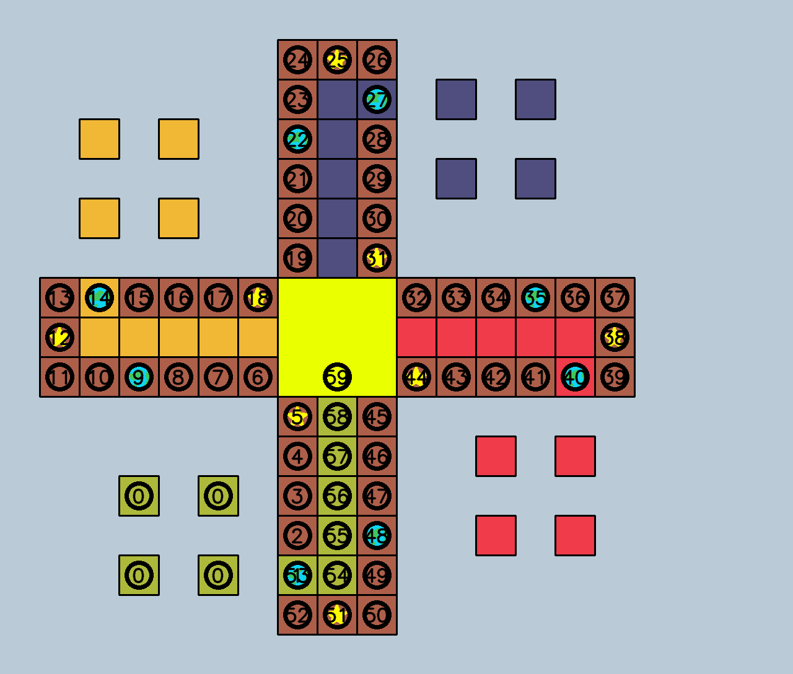

Ludo Reinforcement Learning Agent

# 1. State Representation

Each state for a 2-player game of Ludo is 52 bits long.

    p_t     # Player Turn (0 or 1, 1 bit)
    d       # Dice Roll   (1-6, 3 bits)
    pm_npos # Position of player m's nth pawn on the board (0-59 positions, 6 bits)
            # Each player has 4 pawns on the board, so 6 * 8 = 48 bits will be
            # used to represent the players' positions.

The encoding for the positions of the pawns on the Ludo board. Home and goal
(0 and 59, respectively) are the same encodings for all pawns.

    {p_t}{d}{p1_1pos}{p1_2pos}{p1_3pos}{p1_4pos}{p2_1pos}{p2_2pos}{p2_3pos}{p2_4pos}

    52 =  1 + 3 +   6   +    6   +    6   +    6   +    6   +    6   +    6   +    6

